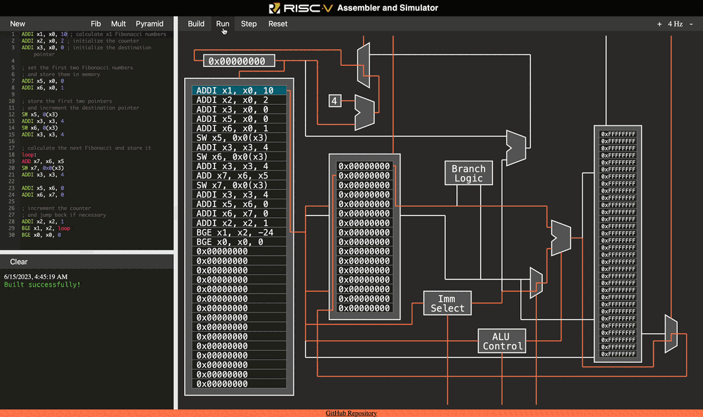

# RISC-V Assembler and Simulator

A fully functional RISC-V Assembler and simulator that runs in web browser.
The assembler and simulator were implemented using TypeScript and HTML5 Canvas.

## Features
- **Assembler**: Convert human-readable RISC-V assembly code into machine code instructions that can be executed by the simulator.
- **Simulator**: Simulate the execution of RISC-V programs, providing a step-by-step visual representation of the CPU state.
- **CPU frequency**: Users can dynamically change the CPU frequency to control the execution speed.
- **Example Programs**: The project includes three example programs:
    - **Fibonacci**: Calculate the Fibonacci sequence up to a specified number.
    - **Fast Multiplication**: Perform fast multiplication of two numbers using bitwise operations.
    - **Pyramid Array**: Generate a pyramid-shaped array of numbers `[0 1 2 ... n-1 n n-1 ... 2 1 0]`.

## Usage
1. Visit the project at [https://srki.github.io/RISC-V-Simulator/](https://srki.github.io/RISC-V-Simulator/).
2. Select an example program or write your RISC-V assembly code using the editor.
3. Click the "Build" button to convert the assembly code into machine code and load the code into the simulator. 
4. Adjust the CPU frequency using the provided interface. (Optional)
5. Click the "Run" button to start executing the program in the simulator.

## Supported instructions
The assembler and simulator support the following instruction from **RV32I** instruction set:
- **B-type**: `BEQ`, `BNE`, `BLT`, `BGE`, `BLTU`, `BGEU`
- **I-type**: `LB`, `LH`, `LW`, `LBU`, `LHU`, `ADDI`, `SLTI`, `SLTIU`, `XORI`, `ORI`, `ANDI`, `SLLI`, `SRLI`, `SRAI`
- **S-type**: `SB`, `SH`, `SW`
- **R-type**: `ADD`, `SUB`, `SLL`, `SLT`, `SLTU`, `XOR`, `SRL`, `SRA`, `OR`, `AND`

## License

This project is licensed under the [MIT License](LICENSE).